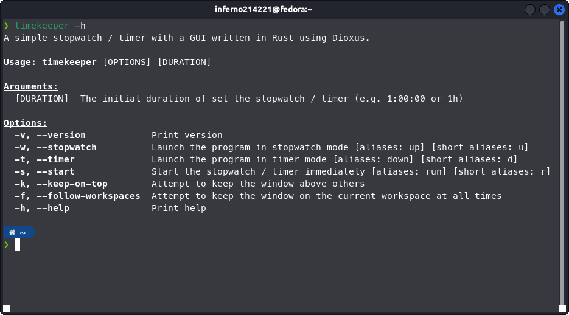

# TimeKeeper

## What

This program is a simple stopwatch / timer with a GUI written in Rust using Dioxus.


## Why

1. This project was primarily an excuse for me to learn how to use Dioxus and write some more Rust.
2. It is suprisingly difficult to find a *simple* stopwatch / timer GUI application for Linux. Especially one that GTK themes. Sadly, this one only themes on my machine^tm. (I should have used a GTK crate of some variety, but the idea was to learn Dioxus).

## Running

```sh
dx serve
```
or
```sh
dx serve --release
```

## Building

```sh
dx bundle --release
```

### Cargo Version Workaround

It appears that the current stable version of Dioxus doesn't support Cargo v4, so to allow the program to run, 'version' within Cargo.lock needs to be manually set to 3.

## Arguments

TimeKeeper has various arguments which, given that it isn't a cli program, are designed for customisation within desktop entries.



### Time Loss Workaround

I'm not sure if it is an XFCE-speicific thing, but the stopwatch / timer freezes while it is minimised or running on another workspace. I need to fix this but in the meantime, the `--keep-on-top` (`-k`) and `--follow-workspaces` (`-f`) flags can be used as a workaround.

This bug is obviously somewhat problematic for timekeeping software, however the workaround isn't one that I hate.