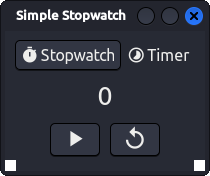
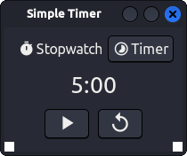

# Simple Stopwatch / Timer

## What

This program is a simple stopwatch / timer with a GUI written in Rust using Dioxus.





## Why

1. This project was primarily an excuse for me to learn how to use Dioxus and write some more Rust.
2. It is suprisingly difficult to find a *simple* stopwatch / timer GUI application for Linux. Especially one that GTK themes. Sadly, this one only themes on my machine^tm. (I should have used a GTK crate of some variety, but the idea was to learn Dioxus).

## Running

```sh
dx serve
```
or
```sh
dx serve --release
```

## Cargo Version Workaround

It appears that the current stable version of Dioxus doesn't support Cargo v4, so to allow the program to run, 'version' within Cargo.lock needs to be manually set to 3.